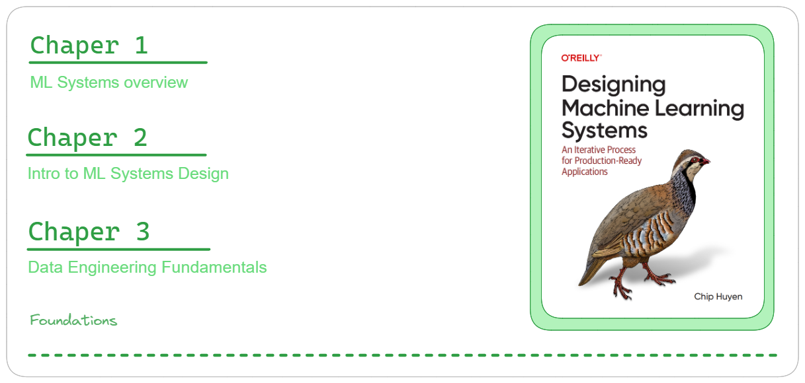

# Foundations - Machine Learning Systems Design

## Summary of Chapters 1, 2, and 3:

Machine learning (ML) systems go beyond just algorithms (like logistic regression). They involve the entire process, from initial business needs to user interfaces and data infrastructure. This includes model development, monitoring, updates, and supporting systems. In the first 3 chapters of the book "Designing Machine Learning Systems," the author Chip Huyen, provides a great overview to understand ML systems, as well as the foundational knowledge for ML Systems Design and Data Engineering. In essence, the book's objective is to equip readers with a comprehensive framework tailored to develop solutions that effectively address their specific problems,regardless of the chosen algorithm's intricacies.

Chapter 1 delves into the fundamental aspects of understanding machine learning (ML). It addresses the question of when to employ ML, acknowledging its versatility across a wide range of problems while cautioning that ML solutions may not always represent the optimal choice. Before embarking on an ML project, it is essential to consider factors such as necessity and cost-effectiveness.

Essentially, the models are described as an approach to learning complex patterns from existing data and utilizing these patterns to make predictions on unseen data. This process hinges on the availability of data for the ML system to learn from. While ML models make predictions, they are only effective for problems requiring predictive answers, emphasizing the importance of unseen data sharing similar patterns with the training data.

The chapter further explores the characteristics of problems suitable for ML solutions, highlighting the necessity of identifiable patterns and the presence of existing data. Additionally, it outlines scenarios where ML shines, such as repetitive tasks, situations with low cost for wrong predictions, scalability requirements, and constantly changing patterns. However, even in cases where ML cannot fully solve a problem, it may still be feasible to leverage ML for partial solutions by decomposing the problem into smaller components.

Moving on, it presents various use cases for machine learning, spanning applications like search engines, recommender systems, predictive typing, etc. It then transitions into an exploration of understanding machine learning systems, highlighting the differences between ML in research and ML in production settings.

This distinction encompasses various factors, including different stakeholders, computational priorities, and datasets. Interpretability emerges as a crucial aspect, with its importance varying between research and production environments. The text also addresses considerations for throughput and latency, historical versus real-time data handling, and the inherent bias perpetuation in ML algorithms, which essentially encode past data rather than predicting the future.

Chapter 2 explores the foundational elements of setting up machine learning (ML) systems, focusing on key objectives and necessary components. Using a four-requirements approach - reliability, scalability, maintainability, and adaptability - akin to building a resilient house, the chapter emphasizes iterative design processes to meet these standards.

Shifting to a business perspective, the author stresses framing problems appropriately for ML solutions, understanding the synergy between data and intelligent algorithms. Aligning system performance with business goals is highlighted, emphasizing the vital connection between ML system performance and broader business objectives. It discusses ML system requirements and development phases, covering project scoping, data engineering, model development, deployment, monitoring, continual learning, and business analysis.

Furthermore, it addresses the balance between algorithm and data emphasis in the system success, emphasizing the crucial role of data and robust data management practices. Overall, Chapter 2 serves as a foundational guide to designing ML systems, offering insights into essential principles and practices necessary for building effective solutions aligned with business objectives.

Chapter 3 delves into the core principles of data engineering essential for successful machine learning (ML) projects. It begins by highlighting the fundamentals of data engineering, emphasizing understanding data collection, processing, storage, retrieval, and formatting in ML contexts. The chapter discusses various data sources, including user input data, system-generated logs, internal databases, and third-party data, each presenting unique challenges. It explores data formats like JSON, CSV, Parquet, Avro, Protobuf, and Pickle, explaining their characteristics and use cases, and differentiates between row-major and column-major formats for data access efficiency. 

Additionally, it covers data models such as relational and NoSQL, emphasizing the importance of appropriate data modeling and storage mechanisms in ML systems. The chapter also delves into data storage engines, distinguishing between transactional and analytical processing, and discusses the Extract, Transform, and Load (ETL) process. It further explains data flow modes through databases, services, and real-time transport, highlighting differences between batch and stream processing methodologies. Overall, the chapter serves as a comprehensive guide to data engineering fundamentals, equipping practitioners with a great foundational knowledge to handle data intricacies in the context of ML systems effectively for real-world applications.

The book goes beyond just algorithms. It equips readers with a comprehensive framework to build effective ML solutions. These first chapters emphasize understanding when and why to use ML, along with the crucial role of data engineering and system design. It highlights key considerations for building robust and scalable ML systems aligned with business goals.
By delving into both foundational concepts and practical aspects, the book empowers readers to develop successful real-world ML applications.
