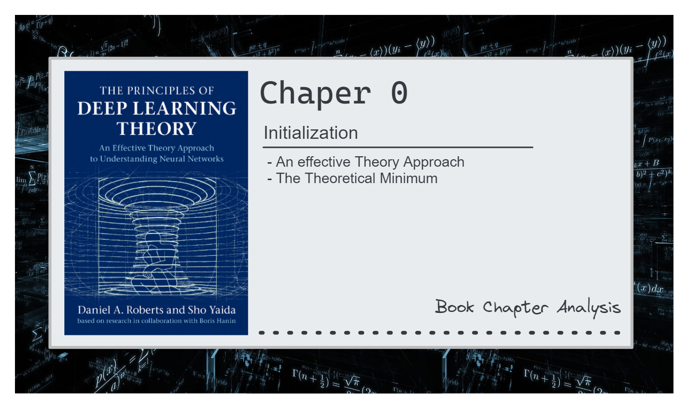

# Book Chapter Analysis - *The Principles of Deep Learning Theory*

### 📌 Objective

Perform a thorough analysis of chapter 0 (zero) of the book **'The Principles of Deep Learning Theory'** available here [[link]](https://arxiv.org/pdf/2106.10165.pdf).

  

### 📚 Chapter Analysis
---

Deep learning (DL), a pivotal component of contemporary artificial intelligence (AI), leverages deep neural networks. These networks, composed of many neurons in parallel organized into sequential computational layers, excel at learning useful representations of the world. This representation learning transforms data into increasingly refined forms that are helpful for solving an underlying task. 

These neural networks, inspired by the structure of biological brains, are great at extracting useful insights from large amounts of real-world data. But understanding them as a whole can be tough due to their complexity. While we can explain how individual parts work and how training improves them, this doesn't always tell us why the network does what it does. That's where the effective theory approach comes in. As the author presented It's like in physics, where scientists try to bridge the gap between tiny particles and the bigger picture. The effective theory approach does the same for neural networks, aiming to explain how they work overall by looking at the basic elements of neurons and how they interact.

The introductory chapter of the book aims to explain using this theory approach the behavior of these systems with numerous elementary constituents. As the authors highlight that the book’s objective is to establish a set of principles that allow for the theoretical analysis of deep neural networks, examining both microscopic and macroscopic principles. They offer the 'theoretical minimum' required to grasp the fundamental concepts of our mathematical and computational system. Their objective is to lay a foundation for you to enhance your understanding of these intricate networks.

The first essential concept that I’d like you to highlight is that a neural network is essentially a recipe for computing a function using building blocks called neurons. Each neuron is a simple function that combines incoming signals with weights, then "fires" by comparing the sum to a threshold. These neurons are organized in parallel layers, with deep neural networks having multiple layers stacked sequentially. The network's behavior is determined by the connections between neurons (weights) and the firing thresholds of each neuron.

Keeping that in mind, we need to emphasize some key components to start our reasoning.

- **Neurons**: as presented before, a neuron is a mathematical function that takes in one or more inputs, applies a weight to each input, sums them up, and then passes the sum through a non-linear function (like a sigmoid function or a ReLU function) to produce an output. This output can then serve as input to other neurons, and so on. The weights on the inputs are adjusted during training to help the network learn.
- **Layers**: A layer is a collection of neurons that are connected to the next layer via weights, which are the parameters of the model. In a neural network, there are typically multiple layers, including an input layer, one or more hidden layers, and an output layer. 
- **Parameters**: The parameters (weights and biases) are the parts of the model that are learned from the training data.
- **Neural Networks**: A neural network is a type of machine learning model that is inspired by the structure and function of the human brain. It's composed of interconnected layers of neurons, which process and transmit information. Neural networks learn from data, and can be used for a variety of tasks.
- **Multilayer Neural Network**: A multilayer neural network, also known as a deep neural network, is a neural network with more than one hidden layer. The additional layers allow the network to learn more complex representations of the data, which can lead to better performance on certain tasks.
- **Representation Learning in Deep Learning**: Representation learning is the idea that instead of manually designing features for a machine learning model, the model can learn to represent the data itself. 

Following from the last topic, the goal is to understand the process of learning of our network. For that one of the key concepts in mind should be the **thinking of a neural network as a parameterized function**. Where we have an input to the function and a vector of a large number of parameters controlling the shape of the function. To make this function useful, the parameters need to be tuned. This tuning process involves two steps: first, initializing the network parameters randomly from a simple probability distribution, and second, adjusting the parameters to minimize the difference between the network's output and a desired target function. This adjustment process is known as function approximation and is achieved by fitting the network to training data.

Despite the apparent challenge posed by the high dimensionality and fine-tuning requirements, the author proposes a method to tackle this issue. They suggest expanding the neural network function as a polynomial using a **Taylor series expansion** around the initialized values of the parameters. This approach allows them to approximate the behavior of the function and understand how it utilizes training data in its approximation process. In essence, the idea is to break down the complex behavior of the neural network function into simpler components through mathematical approximation techniques, enabling a deeper understanding of its workings despite the inherent complexity involved. 

However this kind of approach will depend in a very complicated way on all the quantities at initialization such as the specific random sample of the parameters. Besides other problems related with the Infinite Number of Terms of the series and the Randomness in Parameter Sampling. However, we are not trying to solve these problems in general - since they are not tractable -; we only care about the functions that are deep neural networks.

Regardless of these problems, we can simplify that breaking down a neural network into a function helps demystify the network's behavior providing a conceptual approach for understanding its objective and learning process. Viewing the network as a parameterized function, where inputs are transformed into outputs via adjustable parameters, clarifies its role in mapping input data to desired outputs.

Following this theoretical implication the author explores another fundamental concept: the principle of **sparsity**, the concept that real neural networks have fewer connections than theoretically possible. While analyzing infinitely wide neural networks (networks with an unbounded number of neurons per layer) simplifies the math, it doesn't reflect the reality of real-world networks with limited connections. This is where **sparsity** comes in.

The author explores the principle of **sparsity**, acknowledging the significant difference between theoretical and practical network structures. By incorporating **sparsity**, researchers can bridge the gap between the powerful but impractical analysis of infinitely wide networks and the challenges of finite networks we actually use.

Sparsity-inspired methods, such as truncated descriptions and adjustments based on physical principles, allow us to analyze how real networks learn and make predictions. This not only deepens our understanding of how deep learning functions in practice, but also exposes the theoretical limitations of the infinitely wide model. Hence studying these limitations allows us to understand better theoretically the capabilities and complexities of real neural networks.

The discussed approaches offer valuable insights into neural network behavior, but they may not be easily understandable for all readers due to their complexity. Additionally, while these approaches deepen our understanding, they might not perfectly describe all the complexities of neural network models or resolve all theoretical implications of it. I think that's the reason the book authors acknowledge the complexity involved in developing methods for analytically computing trained networks, highlighting the need for more profound considerations to fully grasp their intricacies. Thus, while these approaches contribute significantly to our understanding, they also underscore the challenges in comprehensively elucidating the workings of neural networks.
